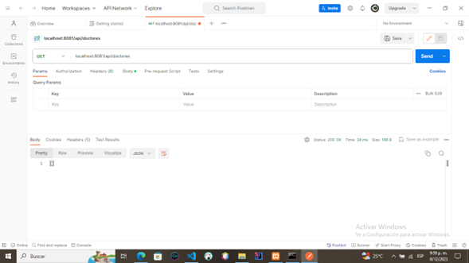
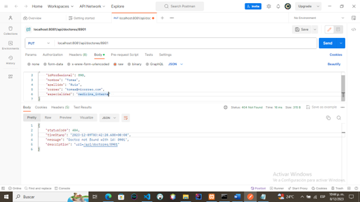
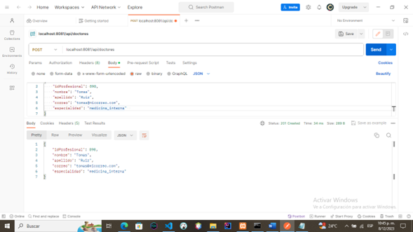
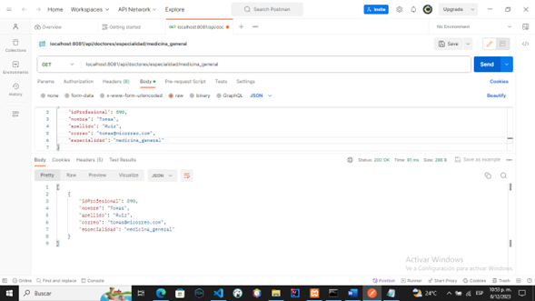
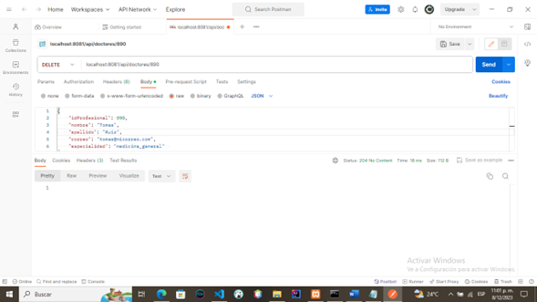

API REST Citas Consultorio Médico:
    -java
    -spring boot
    -maven
    -sql

Creado por:
    -Giovanna Astrid Rueda C
    -Alejandro Rey Vera
    -José David Mejía Meneses
    2023 diciembre

Guía paso a paso para crear una API REST básica con java, spring boot, maven y sql:
    1. Clonar este repositorio utilizando el siguiente comando en Git:
    
    https://github.com/DavidMejiaBogota/doctorsJavaSpringBoot.git

    2. Instalar el paquete requerido :

    mvn clean install

    3. Correr la aplicaión en apiCitasApplication.java

Modelo de la base de datos:

Pruebas postman

Con el objetivo de realizar las pruebas y validaciones del adecuado funcionamiento de la APP Doctors, se realiza un paquete de pruebas con el cliente Postman y el servidor de la aplicación, verificando los tres modelos existentes: Doctores, Pacientes y Citas, a continuación se plasma evidencia del proceso:

### CRUD Paciente

1.	Consultar todos los pacientes de la base de datos:

2. Consultar todos los pacientes de la base de datos buscando un id que no existe:

3. Crear paciente

4. Actualizar paciente.

5. Eliminar paciente.

### CRUD Doctor

1.	Consultar todos los doctores de la base de datos:

2. Consultar todos los doctores de la base de datos buscando un id que no existe:

3. Crear doctor:

4. Consultar doctor por especialidad:

5. Eliminar doctor:

6. Error por creación del mismo doctor que ya existe en la bd:

